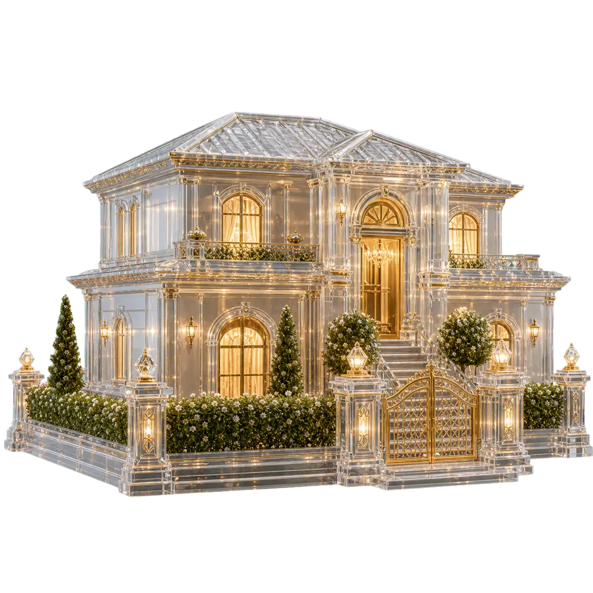

# 🎨 Custom Icons Skill

A specialized skill for creating and managing bespoke icons using AI generation, conceptual design, and vector tracing.

## 🚀 Installation

To add this skill to your agent environment, run:

```bash
npx skills add jkc66/custom-icons-skill
```

## 🛠 Usage

### 1. Generate or Design
Use the instructions in [skill.md](skills/skill.md) to generate artwork or refine a conceptual "desire".

### 2. Process Image
Prepare the image for tracing:

```bash
python3 scripts/crop_and_trace.py path/to/source.png tmp/icons my-new-icon
```

### 3. Trace to SVG
Ensure `potrace` is installed:

```bash
potrace tmp/icons/my-new-icon.pbm --svg --flat -o src/assets/icons/my-new-icon.svg
```

### 4. Optimize
Minify the SVG:

```bash
bunx svgo src/assets/icons/my-new-icon.svg --multipass
```

## 📂 Structure

- `skills/skill.md`: Core logic and instructions for the AI agent.
- `scripts/`: Automation and processing utilities.
- `resources/icons/`: Categorized reference gallery.

---

## 🖼 Reference Gallery

Explore the different styles supported by this skill:

### 💎 Premium (Strategy A)
*Monoline, elegant, thin strokes.*

| | | | | |
| :---: | :---: | :---: | :---: | :---: |
|  |  |  |  |  |


### 🤖 Tech (Strategy A)
*Geometric, bold, 2px stroke weight.*

| | | |
| :---: | :---: | :---: |
|  |  |  |

### 🌿 Lifestyle (Strategy A)
*Organic, hand-drawn, textured edges.*

| | |
| :---: | :---: |
|  |  |

### 🏛 Detailed (Strategy A)
*Intricate, high-detail vector art.*

| |
| :---: |
|  |

### 🌈 Complex (Strategy B)
*3D, multi-color, transparent PNGs (Green Screen workflow).*

| | |
| :---: | :---: |
|  |  |


